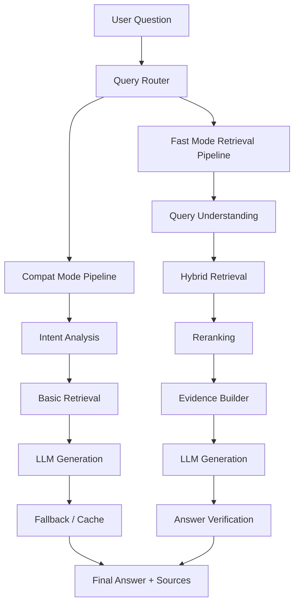
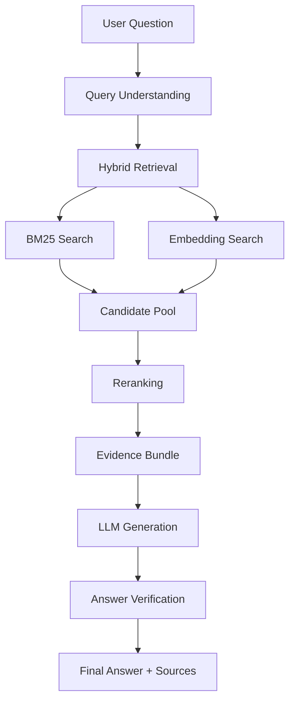

# Bran AI Legal Assistant
## Evidence‑Grounded Legal QA System (Hybrid Retrieval + LLM Verification)

> Applied AI Engineering Project demonstrating **hybrid retrieval systems, LLM orchestration, and evaluation-driven AI development** for regulatory and legal domains.

## Live Demo

- Production URL: [https://xn--xhqt48colas13k.tech/](https://xn--xhqt48colas13k.tech/)
- Note: This project serves Chinese government procurement/regulatory scenarios.  
  For compatibility with government-site linking, browser parsing, and deployment tooling, the domain is shown in ASCII/Punycode form (English characters) in this README.

---

# Overview

Bran AI Legal Assistant is a **retrieval‑augmented legal intelligence system** designed for government procurement and regulatory policy analysis.

The system focuses on **answer reliability, traceability, and retrieval robustness**, which are critical for high‑precision domains such as:

• government procurement regulations  
• compliance analysis  
• legal definitions and policy interpretation  

Instead of relying on naive RAG pipelines, the system implements a **multi‑stage retrieval architecture** combining:

- BM25 lexical search
- dense embedding vector retrieval
- hybrid candidate merging
- reranking
- evidence bundling
- answer verification

This architecture significantly improves **recall, reliability, and citation traceability**.

---

# Key Engineering Highlights

### Hybrid Retrieval Architecture

The system combines **lexical retrieval and semantic retrieval**:

• **BM25 keyword search** ensures legal terminology recall  
• **Embedding vector search** captures semantic similarity  
• **Hybrid retrieval** merges both strategies for higher recall  

---

### Multi‑Stage Retrieval Pipeline

The retrieval pipeline includes:

1. Query understanding
2. Hybrid retrieval
3. Candidate pooling
4. Reranking
5. Evidence bundle construction
6. LLM answer generation
7. Answer verification

---

### Evidence‑Grounded Answering

Rather than generating answers directly, the system:

• retrieves legal evidence  
• structures evidence bundles  
• generates citation‑grounded answers  
• verifies evidence support  

This reduces hallucinations and improves answer traceability.

---

# High‑Level System Architecture

---

# Retrieval Strategy

Legal search systems must handle:

• exact statutory wording  
• partially remembered legal phrases  
• natural language descriptions of rules  

A single retrieval method cannot handle all query types reliably.

The system therefore implements **hybrid retrieval**.

---

# Stage 1 — BM25 Lexical Search

BM25 retrieves documents using **keyword matching**.

It performs well for queries containing:

• statute names  
• legal terminology  
• article numbers  
• policy keywords  

Example:

Definition of centralized procurement  
Government procurement law article bidding requirements

This ensures **exact legal phrases are not missed**.

---

# Stage 2 — Embedding Vector Retrieval

Documents are embedded into vector space.

Semantic search allows the system to retrieve passages even when queries use **different wording**.

Example:

Who supervises procurement activities  
How are suppliers evaluated during bidding

Embedding retrieval matches **conceptual meaning rather than keywords**.

---

# Stage 3 — Hybrid Retrieval

The system merges results from:

BM25 lexical search  
Embedding semantic search

Benefits:

| Challenge | Solution |
|----------|----------|
| keyword mismatch | embedding retrieval |
| semantic mismatch | BM25 retrieval |
| inconsistent queries | hybrid recall |

Hybrid retrieval significantly improves **recall and robustness**.

---

# Stage 4 — Reranking

Candidate passages are reranked based on:

• semantic similarity  
• legal entity detection  
• structural anchors  
• metadata signals  

This removes noisy results and promotes the **most relevant evidence**.

---

# Stage 5 — Evidence Bundle Construction

Instead of sending raw chunks to the LLM, the system builds an **evidence bundle** containing:

• top ranked passages  
• document metadata  
• legal anchors  
• contextual references

This improves reasoning quality and citation reliability.

---

# Stage 6 — LLM Answer Generation

The LLM receives the evidence bundle and generates answers that include:

• citations  
• referenced passages  
• explanation of legal rules

---

# Stage 7 — Answer Verification

The answer verifier checks:

• claim‑evidence alignment  
• citation validity  
• answer completeness  

If issues are detected, the system performs **answer repair** before returning the response.

---

# Retrieval Pipeline Diagram

---

# Naive RAG vs This System

Typical RAG pipeline:

Question → Embedding Search → LLM

Problems:

• missed retrieval results  
• irrelevant passages  
• hallucinated answers  
• poor citation traceability  

Bran AI Legal Assistant pipeline:

Question  
↓  
Query Understanding  
↓  
Hybrid Retrieval (BM25 + Embeddings)  
↓  
Reranking  
↓  
Evidence Bundle  
↓  
LLM Generation  
↓  
Answer Verification  

This architecture improves:

• retrieval recall  
• answer reliability  
• evidence traceability

---

# Benchmark Evaluation

The system is evaluated using a curated legal QA dataset.

| Metric | Compat Mode | Fast Mode |
|------|------|------|
| Success Rate | 92% | 94% |
| Evidence Hit Rate | 90% | 94% |
| Avg Latency | 2.2s | 1.8s |
| Error Rate | <2% | <2% |

Evaluation scripts automatically run **quality gate checks** before deployment.

---

# Technology Stack

### Backend

Java 21  
Spring Boot 3.4  
Maven

### Document Processing

Apache Tika  
Apache PDFBox  
Apache POI  
Jsoup

### OCR

Tesseract  
OCRmyPDF

### Retrieval

BM25 lexical retrieval  
Embedding vector retrieval  
Hybrid retrieval pipeline  
Reranking module

### LLM Integration

Unified LLM client abstraction  
MiniMax API

### Deployment

Docker  
Cloud deployment scripts  
Health monitoring

---

# Example Repository Structure

src/

controller/  
QueryController.java  

service/

QueryService.java  
CompatModeQueryService.java  
QueryIntentAnalyzer.java  

fast/v2/

HybridRetriever.java  
RerankService.java  
AnswerVerifier.java  

util/

TextExtractor.java

resources/

application.yml

---

# API Example

Health check

curl http://localhost:8080/api/v1/healthz

Ask question

curl -X POST http://localhost:8080/api/v1/chat/ask

---

# AI Engineering Skills Demonstrated

This project demonstrates practical **Applied AI Engineering capabilities**:

• Hybrid search design  
• Retrieval system engineering  
• RAG architecture design  
• LLM orchestration  
• Evidence‑grounded reasoning  
• Benchmark evaluation pipelines  
• Production‑ready backend architecture  

---

# Target Roles

This project aligns with roles such as:

Applied AI Engineer  
AI Engineer  
LLM Engineer  
Retrieval Engineer  
AI Backend Engineer  
Machine Learning Engineer (Applied)

---

# Resume Description

Built an evidence‑grounded legal QA system for regulatory and procurement analysis using hybrid retrieval (BM25 + embedding search), reranking, OCR document ingestion, and answer verification, improving reliability and citation traceability for legal AI systems.
